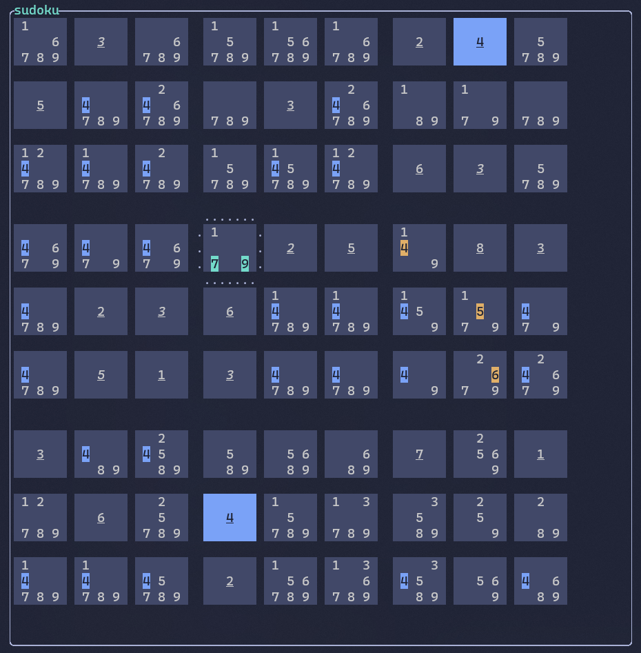

# Sudoku TUI

Sudoku TUI is an application for solving sudoku in terminal. I am writing this for two reasons: I need an app that will allow me to mark and color cells however I want to (without the need to use MS Paint), and I want to learn Rust.

## How to use

### Loading/saving board

Load sudoku grid from string:
`cargo run 000000240500030000000000600000005083020600000001000000300000701060400000000200000`

Load saved sudoku:
`cargo run recent.sudoku`.

Export sudoku to file:
In application press `f` to open menu, then select option `3`. Board will be saved to `recent.sudoku`.

To have multiple saved boards change file name to e.g. `board1.sudoku`. To later load it run: `cargo run board1.sudoku`. All saved boards must have `.sudoku` extension.

### Moving cursor

Use `WASD` to move cursor. Pressing `W` moves one cell up. `Shift`+`W` moved 3 cells up.

### Modes
Press letter to enter mode.
- `i` insert (default) - pressing number will insert value to cell
- `n` note - pressing number will toggle option in a cell
- `h` highlight - pressing number will highlight all positions of a value, all previous coloring will be deleted
- `H` multi highlight - pressing number will highlight all positions of a value, existing coloring will be preserved
- `m` mark - pressing number will highlight value option in current cell
- `M` color selection - pressing number will select color for future marking
- `f` menu - menu will be displayed

